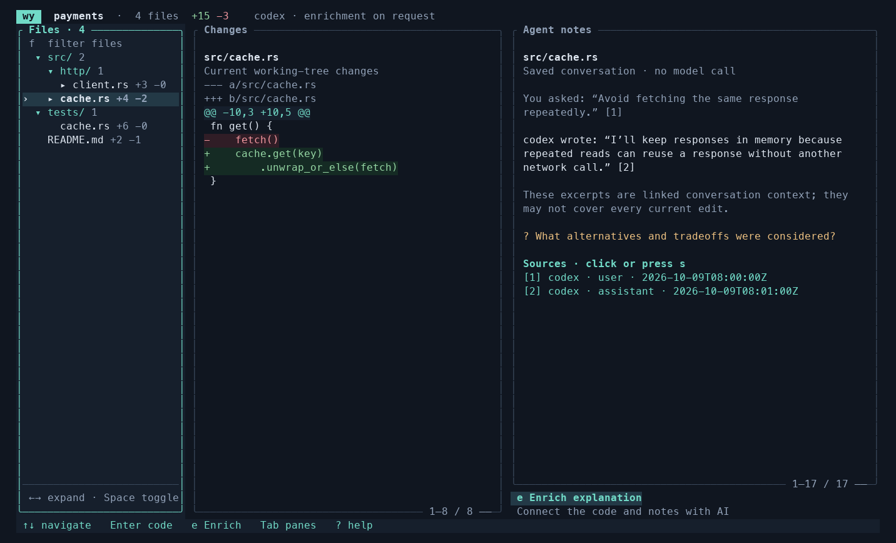

<div align="center">


# wy

### Understand the decisions behind your changes—with evidence on demand.

[](#status)
[](#how-it-works)
[](#what-the-evidence-means)
[](LICENSE)

</div>

Your agent changed 40 files. What consequential choices explain those changes?
wy starts with decisions for the **latest captured coding session**.
Open a choice to understand its rationale, alternatives and trade-offs; inspect
code evidence next, and original agent context only when you need it.

A session defines the work being inspected; one decision can span several files.
Captured edits remain available after commits, later changes, or file deletion.
Today's code is an optional comparison—not a substitute for historical evidence.
wy cannot reliably identify a live agent, so it says **latest captured**, not current.

It imports existing local **Codex, Claude Code, pi, and OpenCode** history. No
recorder has to be running first. Missing evidence stays missing—wy does not turn
a nearby message into a proven reason for a change.



*The screenshot illustrates the secondary file/history reader. The default screen is now the decision overview.*

## Get started

Needs Rust 1.88+, Git and a C toolchain.

```bash
cargo install --git https://github.com/grandimam/wy --locked wy-code
cd /path/to/your/repo
wy
```

- **Decisions (`d`):** inspect the selected session's choices, with recorded/inferred/unknown rationale.
- **Identify decisions with AI (`e`):** explicitly request a cited assessment of captured edits from that session only. No model runs automatically.
- **Sessions (`t`):** bordered requests, collapsible agent responses and notes, and chronological change groups. Open an edit to read its captured code.
- **Compare with current code:** optional, inside an edit. Partial or unconfirmed captures cannot establish a full historical file.
- **Choose another session (`b` or `/sessions`):** older sessions appear only in the picker.
- **Refresh (`r`):** recapture history offline, keeping the selected session when available.

**Decisions / Sessions** form the left navigation; narrow terminals use a compact top row. Original conversations are a final drill-down, not a separate History section. **As implemented** shows captured code, including explicit execution and truncation gaps. A clean Git tree does not erase session work. No history means no session reconstruction—not an automatic fallback to today's diff.

**Ctrl+Left/Right** switches sections · **s** selects links · **?** opens help.

## Understand history and decisions

| Command | What it shows |
|---|---|
| `/coverage` | Per-tool discovery/capture counts, exclusions, warnings, and unmatched hunks |
| `/sessions` | Session picker; selecting one scopes both decisions and implementation flow |
| `/timeline [FILE:SYMBOL]` | Chronological turns associated with a file or explicitly mentioned symbol |
| `/decisions` | Selected-session decisions (also **d**) |
| `/changes` | Working-tree changes, explicitly not assigned to the selected session |
| `/decisions discover` | Explicit AI discovery, grouping and prioritization of consequential choices |
| `/decisions FILE:SYMBOL` | File-specific recorded decision context, requirements, tests, and gaps |
| `/source all` | Include all four tools; `both` remains a compatibility alias |
| `/source pi` | Select one history tool; press **r** to refresh |
| `/setup` then `/setup save` | Preview and save optional decision-record instructions; does not modify agent configuration |
| `/export` then `/export save` | Export the working-tree review (not the session brief); preview first, nothing uploaded |

Omitting `FILE:SYMBOL` from `/timeline` uses the selected file/symbol; `/decisions` without an argument opens the selected-session overview. Symbol filtering is based on
explicit text/record matches, not semantic causality. A timeline preserves tool and
session boundaries; later edits are flagged as potentially making earlier context
inapplicable, not automatically declared to supersede it.

Dates distinguish **when the agent recorded an event** from **when wy captured
history**. Absolute UTC dates and relative ages are shown; missing dates are marked
unknown rather than inferred from transcript file modification times.

## How it works

1. Discover supported local histories whose recorded working directory belongs to this Git repository.
2. Capture up to 20 sessions / 40 MB, alternating between tools; `/coverage` explains exclusions.
3. Select the latest dated captured session. Preserve each supported edit in source order, rather than keeping only the latest edit per file.
4. Group explicit decision records within that session, linking them to captured edits. File association is not proof of causal intent.
5. On explicit request, identify and prioritize decisions using only bounded evidence from the pinned session snapshot. Validate session identity, captured-edit citations and recorded-reason quotes.
6. Compare with today's code only on demand. Complete, successful final captured writes can establish textual differences; partial patches are never replayed onto today's code to invent a historical base.

Briefs are cached by repository and session snapshot, not the current Git HEAD or
file hashes. New session content invalidates the brief; later commits and unrelated
working-tree changes do not. Tool invocation supports Codex and Claude only.
The picker covers captured sessions, not every session that may exist on disk.

## What the evidence means

- **Recorded decision:** a self-reported structured explanation, not independently verified truth.
- **Nearby conversation:** captured context; proximity does not prove causation.
- **Available rationale:** readable provider-exposed thinking or reasoning summaries; tentative, not a verified justification.
- **Compaction summary:** secondary context, not original speech.
- **Inferred explanation:** a new model assessment, separate from historical intent.
- **Unknown:** evidence was not captured or cannot establish the claim.

Encrypted/redacted hidden reasoning cannot be recovered. Shell commands, formatters,
and manual changes often have no supported edit records. A missing record does
not mean the agent had no reason or that tests were never run.

Offline views never call a model. Requesting an explanation sends selected evidence
to your configured reasoning CLI. Exports exclude raw tool outputs and tentative
rationale, apply best-effort redaction, and require a preview before saving—**inspect
for sensitive content before sharing**.

## Status

**Experimental (0.2.0).** Useful for reviewing substantial local agent changes and
returning to unfamiliar code. Not a replacement for code review or a guarantee of
original intent. Older OpenCode JSON storage is detected but not imported. Some
provider formats and shell-driven edits remain unsupported.

Automated tests establish implementation behavior, not explanation accuracy or
user value. See the [evaluation protocol](docs/evaluation.md) for measuring those.

## Learn more

[Usage](docs/usage.md) · [Decision records](docs/decision-records.md) · [Architecture](docs/architecture.md) · [Security](docs/security.md) · [Codex formats](docs/codex-formats.md) · [Releasing](docs/releasing.md)

Development: `cargo test --locked`. Licensed under [MIT](LICENSE).
