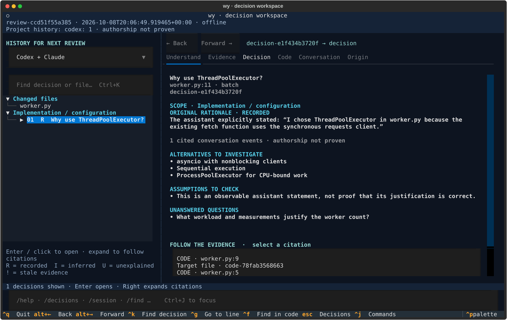
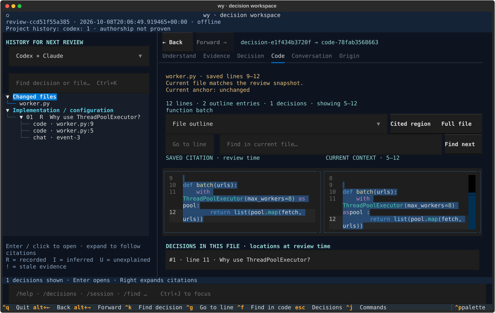

<div align="center">

# wy

### AI wrote the code. Know why before you own it.

Understand the decisions behind a change—then follow the evidence into the code and conversation.

[](pyproject.toml)
[](#from-agent-output-to-code-you-understand)
[](#local-by-default-ai-when-you-ask)
[](LICENSE)

[Get started](#get-started) · [Try the demo](#try-it-on-a-real-diff) · [How it works](#from-agent-output-to-code-you-understand) · [Command guide](docs/usage.md)

</div>



<p align="center"><sub>Actual terminal capture · bundled demo with synthetic Codex history · offline analysis</sub></p>

A diff tells you **what changed**. wy helps you investigate **why that approach was chosen**, **what assumptions remain**, and **what you should check before shipping**.

It brings your Git changes, relevant repository code, and project-matched Codex or Claude Code history into one terminal workspace. Start with an offline decision review; ask your installed agent CLI for a deeper explanation when you need one.

> **“Why a thread pool—and why eight workers?”**<br>
> In the demo, wy finds the agent's stated reason: the existing client is synchronous. It links that statement to the code, lists alternatives to investigate, and leaves the worker count as an open question.

## From agent output to code you understand

| You want to know… | wy gives you… |
| --- | --- |
| **What problem does this change solve?** | An opt-in agent explanation of the problem, before/after behavior, tradeoffs and checks. |
| **Why this implementation?** | Detected choices with recorded rationale, evidence-backed hypotheses or an explicit “unexplained” status. |
| **Where did that explanation come from?** | Navigable citations into code, saved conversation events and linked tool calls/results. |
| **What still needs checking?** | Assumptions, alternatives, unresolved questions and stale evidence. |
| **Does the evidence still match the code?** | Saved excerpts beside current source, with changed or ambiguous locations flagged. |

**Read the decision → inspect the evidence → check the code → ask a better question.**

<details>
<summary><strong>See the code evidence view</strong></summary>



The original citation stays intact. The current file appears separately, so moved or changed code doesn't silently rewrite the evidence.

</details>

## Get started

Requires **Python 3.11+**, **Git**, and [uv](https://docs.astral.sh/uv/). Install from source:

```bash
git clone https://github.com/grandimam/wy.git
cd wy
uv sync
uv tool install .
```

Then open a repository with changes you want to understand:

```bash
cd /path/to/your/repo
wy review                 # Review the diff and matching project history, offline
wy                        # Open the terminal workspace
```

Select a decision to inspect its rationale and citations. For a broader explanation, use the **Understand** tab: choose Codex or Claude, then **Explain changes**. This requires the chosen CLI to be installed and signed in, and may consume your account's usage.

**No agent history?** Review still works using repository evidence. **No model account?** Offline review and evidence browsing still work.

Local reviews are stored in `.wy/`. Add `.wy/` to your repository's `.gitignore` before sharing it; wy does not edit the ignore file for you.

## Try it on a real diff

From the wy checkout, create a throwaway repository containing a sequential-to-threaded download change and a synthetic Codex conversation:

```bash
uv run python examples/make_demo.py /tmp/wy-demo
uv run wy review --repo /tmp/wy-demo --session /tmp/wy-demo/.wy/demo-session.jsonl
uv run wy --repo /tmp/wy-demo
```

Use a fresh destination if `/tmp/wy-demo` already exists. The demo never executes the sample application and needs no application dependencies.

Open **Why use ThreadPoolExecutor?** to see the recorded justification, follow a code citation, then inspect the saved conversation. The review also asks what measurements justify the worker count.

Prefer a quick answer in your shell?

```bash
uv run wy explain worker.py:11 --repo /tmp/wy-demo
uv run wy ask worker.py:11 'What alternatives exist?' --repo /tmp/wy-demo
uv run wy gaps --repo /tmp/wy-demo
```

The demo prints a snapshot ID. Add `--baseline snapshot-…` to the review command to isolate changes since that snapshot.

## Fit it into your agent workflow

Before the agent starts, capture the current working tree:

```bash
wy snapshot --json
# Run Codex, Claude Code, or both as usual.
wy review --baseline <snapshot-id>
wy
```

Without a baseline, wy compares **HEAD to the current working tree**, including staged and non-ignored untracked files. A snapshot separates new changes from pre-existing edits; concurrent human or agent edits can still be included.

Project history is discovered automatically for both agents. Narrow it when needed:

```bash
wy sessions                         # List sessions belonging to this repository
wy review --source claude           # Use only matching Claude Code history
wy review --source none             # Use repository evidence alone
wy review --session codex:<id>       # Select a session; repeat for multiple sessions
```

For a fresh, cited explanation through an installed agent CLI:

```bash
wy reason --agent codex
wy reason --agent claude --file worker.py
wy reason --agent codex --question 'What changed, and what should I test?'
```

## Evidence you can question

wy keeps **what was stated**, **what is inferred**, and **what is unknown** distinct.

| Status | Meaning |
| --- | --- |
| **Recorded** | A relevant, explicit justification was found in the agent's observable transcript. |
| **Inferred** | Repository evidence supports a hypothesis; assumptions remain visible. |
| **Unexplained** | The choice is visible, but its motivation is not established by the available evidence. |

A recorded statement can still be wrong. A linked session does not prove authorship. A new model assessment stays separate from the original rationale and never upgrades it to **Recorded**.

## Local by default. AI when you ask.

| Mode | What runs | What you need |
| --- | --- | --- |
| **Offline review** · `wy review`, `wy explain`, `wy ask` | Local detection, evidence retrieval and cached investigation. No model or network request. | A Git repository. |
| **Agent explanation** · `wy reason`, in-app `/reason` or `/ask` | Your installed Codex or Claude CLI receives bounded, redacted evidence and returns a fresh assessment. | The selected CLI, sign-in and available account usage. |
| **Optional model enrichment** · `--model` | A configured Ollama-compatible endpoint enriches detected decisions or answers follow-ups. | An explicitly configured model and endpoint. |

wy does not modify application source or execute the code it reviews. Reviews, source snapshots and normalized conversation excerpts stay in local `.wy/` artifacts unless you explicitly request model processing. Redaction is best-effort; local artifacts are not encrypted.

See the [model setup and reflection workflow](docs/usage.md#optional-model-analysis) for Ollama configuration and assessments supplied by an existing coding conversation.

## A few commands worth remembering

| In your shell | Purpose |
| --- | --- |
| `wy decisions` | List detected decisions and review origin. |
| `wy explain 1` | Inspect a decision's rationale, citations and later assessments. |
| `wy evidence 1 2` | Open the second citation for the first decision. |
| `wy gaps` | Find unanswered questions, unexplained choices and stale findings. |
| `wy decisions --json` | Get structured output for scripts. |

Inside the workspace, **Ctrl+J** opens the command bar; `/help` lists commands. **Tab** moves focus, **Alt+Left / Alt+Right** navigate history, and **Ctrl+Q** exits.

In-app `/ask` calls the selected agent CLI. The shell command `wy ask TARGET 'QUESTION'` works offline unless you add `--model`.

## Scope and development

wy is an early **0.1.0 MVP**. Offline detection is deliberately selective and capped at twelve decisions per review. It covers patterns such as concurrency, caching, dependency versions, operational limits, broad exception handling and retries; it does not discover every architectural decision. Python gets AST-based analysis; other supported text files use line anchors. Retrieval is lexical, and citations need human judgment.

From the checkout:

```bash
uv sync
uv run pytest -q
uv run ruff check src tests benchmarks examples
uv run python benchmarks/run.py
```

The synthetic benchmark checks regressions, not real-world accuracy. See [evaluation](docs/evaluation.md) for its scope.

[Command guide](docs/usage.md) · [Architecture and limitations](docs/architecture.md) · [Security boundaries](docs/security.md) · [Codex format support](docs/codex-formats.md)

Licensed under [MIT](LICENSE).
