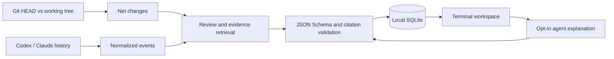

# Architecture

wy is an interactive Rust terminal workspace with no subcommands. Diffs, symbols and observable conversation messages supply evidence for engineering judgments.

- `main.rs` resolves the repository (`--repo`) and starts the workspace; there are no subcommands or JSON output.
- `tui.rs` manages view history, question scope and background agent requests with progress and cancellation. Drafts keep their scope when an answer arrives. Answers are reused per file or symbol and check source freshness when reopened; terminal modes are restored on exit.
- `tui/explorer.rs` projects each review into a collapsible folder/file/symbol tree, with path filtering and session review marks that reset for changed content. `tui/document.rs` builds the reader: each hunk of the diff in file order, with the agent's reason placed above the hunks it explains, plus answers that lead with recorded justifications. `tui/render.rs` draws the two areas (tree and reader) with the terminal's own colours, and handles focus, input and mouse hit areas.
- The workspace's commit browser opens saved conversations without replacing the working-tree review or its reading history. `tui/layout.rs` manages the draggable, keyboard-adjustable file-tree width, saves it locally, and clamps it for smaller terminals.
- `history.rs` discovers project-matched Codex and Claude transcripts and normalizes observable events. Private reasoning and system records are omitted.
- `history/provenance.rs` classifies original messages, summaries and unknown captures at import, preserving available turn/message IDs and direct session lineage. `history/origins.rs` resolves explicit original references within repository and fork boundaries, pins saved source messages, and exposes missing or partial origins. It does not derive ancestry or intent from prose. Evidence identity includes captured content and provenance so resumed captures cannot collide merely by reusing a transcript line number.
- `history/attribution.rs` links diff hunks to recorded edits by exact changed-line text (ignoring punctuation-only lines), and groups hunks under the agent message written just before the edit, with the user request that started the turn. Hunks with no matching edit are reported as unexplained; nothing is inferred from prose or timing. The importer also records the model named in each turn (Codex) or message (Claude).
- `history/edits.rs` extracts static Codex patches (including literal `tools.apply_patch` calls inside `exec`), completed file-change records and Claude Write/Edit/MultiEdit inputs. It never executes transcript code. `history/recent.rs` selects bounded recent edits, excludes known failures and resolves explanation scope against immutable saved sessions. These records remain separate from Git net changes.
- `repository.rs` reads Git revisions and working trees without applying patches or running repository code.
- `source.rs` uses tree-sitter for Rust, JavaScript, TypeScript and JSON outlines, and extracts Markdown headings. Other eligible text files use line anchors.
- `service.rs` builds a review: HEAD-to-working-tree changes, repository-scoped history captures and recent session edits.
- `reasoning.rs` prepares bounded evidence packets, calls the selected agent, validates citations and saves fresh assessments separately from recorded rationale.
- `agent.rs` runs explicit requests in temporary directories with repository tools and configuration disabled, output limits, cancellation and timeouts.
- `storage.rs` persists versioned JSON artifacts in local SQLite and writes an atomic review cache.
- `commits.rs` resolves commit revisions and retrieves pinned conversation snapshots through the local `commit_reviews` index. Lookup can populate the index by matching a review's base to the commit's parent and its captured source hashes to the committed snapshot; `/link` adds an explicit association. Each link records its basis, and no association is inferred from a review's HEAD alone.
- `security.rs` bounds and redacts inputs and validates source paths.

The workspace merges recent session files into its navigation tree without adding them to the Git diff. One reader shows reasons and changes together; saved answers open in the same reader. Source hit areas follow wrapped, scrolled text. An explanation of session code pins its captured edit and nearby conversation ahead of current-source context; answer reuse distinguishes that capture from the current diff of the same file.

A review compares HEAD with the current working tree, including staged and non-ignored untracked files. It does not separate pre-existing edits from the agent's and does not prove authorship.

Source evidence carries original file hashes. Saved answers check freshness when reopened. Captured transcript evidence remains historical. New model assessments retain their original evidence packet and flag changes during generation.

Recorded rationale requires an exact cited original assistant message. Summaries and unclassified history remain secondary or unknown even when written in the first person. Validation rejects inferred rationale supported only by those sources. Older saved answers are conservatively relabeled on display without rewriting immutable captures. Structural checks cannot establish whether a quote semantically justifies a particular code choice.

Lexical matches and structurally valid citations do not establish semantic correctness. Local artifacts are unencrypted and have no automatic deletion policy.
