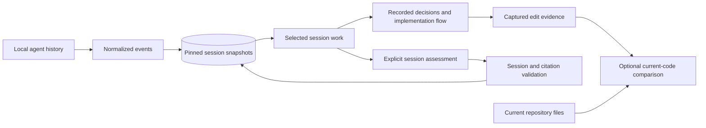

# Architecture

wy is a repo-first observer of coding-agent history, not the interface that launches
an agent. The primary scope is a selected captured session. It defaults to the
latest known source-event date, never claims live-session detection, and never
uses today's Git diff to assign edits to a session.

## Session work and decisions

- `history.rs` and adapters import repository-scoped Codex, Claude, pi and OpenCode
  histories, including supported edit inputs and tool outcomes. The capture is
  bounded to 20 sessions / 40 MB, with 20 MB per transcript.
- `history/recent.rs::records` extracts all supported edits from one saved session
  in source order, normalizes eligible paths and excludes known failures. The
  exported `session_edits` function is distinct from `recent_code`, which is a
  legacy bounded latest-edit-per-file projection.
- `session_work.rs` builds the selected session's file set, requests and edit
  sequence. It does not read current files to reconstruct historical content.
  `load` resolves and verifies the pinned snapshot identity and repository scope.
  Packet assembly includes only that session's captured edits and public context,
  bounded by size and item count. Unsupported, unconfirmed or partial work is not
  repaired by borrowing today's code or another session's edits.
- `decisions.rs` groups self-reported records within the selected session and runs
  opt-in retrospective discovery. `data/decision-brief.schema.json` bounds responses
  to eight decisions. Validation requires captured-edit citations for every affected
  file, confines every evidence item to the selected tool/session/snapshot, and
  requires exact original assistant quotes for recorded rationale. Alternatives
  are assessments unless explicitly attributed. Structural validity does not prove
  semantic support.
- `decision_brief` artifacts include their evidence packet, scope kind and snapshot
  metadata. Session cache identity is repository + immutable session key. Current
  file hashes and Git HEAD are deliberately absent: commits and later edits do not
  invalidate historical explanations, while newly captured session content does.
- The earlier change-set assessment API remains separate for compatibility. It
  validates diff citations and current source hashes; the default TUI does not use
  that path for session decisions.

## User interface

`tui.rs` owns selected-session state, reading history and cancellable background
jobs. The navigation has **Decisions / Sessions**, displayed on the left or in a
compact top row on narrow terminals. Session selection changes both the decision
scope and implementation flow. Older sessions appear only in the picker. Refresh
retains the selected tool/session identity when still captured, otherwise falls
back to the latest available capture.

`tui/decision_views.rs` presents choices, rationale, alternatives and trade-offs,
then captured code evidence and original context. Metadata and general caveats are
collapsed; missing evidence and rationale provenance remain visible.

`tui/session_views.rs` renders the picker, chronological implementation flow,
captured edits and optional current-code comparison. Flow pages contain 20 edits;
repeated edits to a file are preserved. This is implementation chronology, not a
runtime call graph. Original conversation uses the existing paginated history
reader. `tui/code_view.rs` renders code without treating snippet-relative patch
coordinates as real file line numbers.

Background results are cached but cannot change the selected snapshot or interrupt
a draft, deep dive or evidence view. Session artifacts bypass current-source
freshness checks because they describe immutable captured work. Current comparisons
are explicitly read on demand and presented separately.

## Historical code versus current code

`session_work::compare` reads the current file only on the comparison action.
Whole-file equality/difference is reported only for a complete, successful final
captured full write. Comparisons use redacted text and ignore final newlines;
partial patches, truncation, unconfirmed execution and nonfinal writes report
comparison unavailable. A difference does not prove reversal, supersession,
authorship or that the change happened after the entire session ended. Missing or
unreadable current files are not automatically declared deleted.

Historical patches are never applied to today's files to invent earlier bases.
Saved code and context remain readable when current files or source transcripts
are deleted, provided the saved repository-scoped snapshot is still resolvable.

`/changes` exposes working-tree deltas with attribution unknown, without assigning
them to the selected session. `service.rs` still captures HEAD-to-working-tree
reviews for diagnostics and legacy tools. `reasoning.rs` provides separate opt-in
current-file explanations, explicitly distinct from session decision discovery.

## Evidence, storage and execution

- `history/provenance.rs` assigns original/secondary/unknown provenance at import.
  `history/origins.rs` resolves explicit original references within repository and
  fork boundaries. Summaries cannot establish original intent; hidden reasoning
  cannot be recovered. Content and provenance contribute to evidence identity.
- `history/attribution.rs` provides textual diff-to-edit overlap for diagnostics and
  legacy file readers, never proof of ownership or causality.
- `repository.rs` and `source.rs` read Git/source data without executing repository
  code. `security.rs` bounds and redacts content and restricts eligible paths.
- `agent.rs` runs only explicitly requested Codex/Claude assessments in temporary
  directories, with repository tools/configuration disabled, cancellation, timeouts
  and output limits. No model calls occur while opening, refreshing or navigating.
- `storage.rs` persists local JSON artifacts in SQLite and writes atomic review
  caches. Snapshots are pinned; later transcript changes do not rewrite them.
- `commits.rs` retrieves saved conversations through explicit or source-snapshot
  review associations, not inferred session ownership. Commit browsing does not
  replace the selected-session scope.

Local artifacts are unencrypted, redaction is best-effort, and there is no automatic
deletion policy. Tests establish behavior, not real-model accuracy or the two-minute
comprehension outcome; see [Evaluation](evaluation.md).
