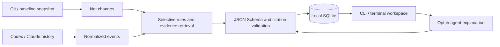

# Architecture

wy is a Rust CLI and terminal workspace. Diffs, symbols and observable conversation messages supply evidence for engineering judgments.

- `main.rs` defines commands, argument validation, JSON output and error handling.
- `tui.rs` manages view history, question scope and background agent requests with progress and cancellation. Drafts keep their scope when an answer arrives. Answers are reused per file or symbol and check source freshness when reopened; terminal modes are restored on exit.
- `tui/explorer.rs` projects each review into a collapsible folder/file/symbol tree, with path filtering and session review marks that reset for changed content. `tui/document.rs` builds highlighted diffs and answers that lead with recorded justifications. `tui/render.rs` handles focus, responsive panes, input and mouse hit areas.
- `history.rs` discovers project-matched Codex and Claude transcripts and normalizes observable events. Private reasoning and system records are omitted.
- `repository.rs` reads Git revisions, working trees and imported diffs without applying patches or running repository code.
- `source.rs` uses tree-sitter for Rust, JavaScript, TypeScript and JSON outlines, and extracts Markdown headings. Other eligible text files use line anchors.
- `engine.rs` detects a bounded set of caching, retry, database, dependency and configuration choices. Evidence retrieval is lexical. Recorded rationale requires an explicit file-specific assistant statement.
- `reasoning.rs` prepares bounded evidence packets, calls the selected agent, validates citations and saves fresh assessments separately from recorded rationale.
- `agent.rs` runs explicit requests in temporary directories with repository tools and configuration disabled, output limits, cancellation and timeouts.
- `provider.rs` supports optional Ollama-compatible enrichment. Model responses cannot upgrade a decision to Recorded.
- `reflection.rs` manages nominated questions and imported retrospective assessments with source-freshness checks.
- `storage.rs` persists versioned JSON artifacts in local SQLite and writes an atomic review cache.
- `trace.rs` preserves original citations while showing current source and chronological transcript context.
- `security.rs` bounds and redacts inputs and validates source paths.

A snapshot isolates changes since that working tree, including later commits. It does not prove authorship. Without a baseline, review compares a Git revision with the current working tree, including staged and non-ignored untracked files.

Decisions and source evidence carry original file hashes. Cached reads check freshness; changed source invalidates a decision rather than shifting its anchor. Captured transcript evidence remains historical. New model assessments retain their original evidence packet and flag changes during generation.

Detection is selective and capped at twelve decisions. It cannot discover every architectural choice. Lexical matches and structurally valid citations do not establish semantic correctness. Local artifacts are unencrypted and have no automatic deletion policy.
