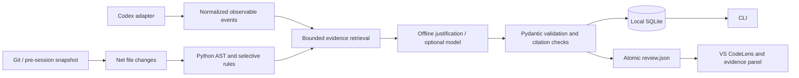

# Architecture

wy stores engineering decisions as the central entity. Diffs, symbols and transcript messages supply evidence; they are not themselves explanations.

## Boundaries

- `ingestion/`: `SessionCollector` protocol and the Codex rollout/exec adapters. Only supported observable event types are normalized. Reasoning, encrypted content, system prompts and unknown event types are omitted. Raw source records are never executed.
- `repository.py`: Git enumeration, safe text reads, revision comparison, unified diff import, and Python AST symbol boundaries. Git index and application source are not modified. `git cat-file` reads committed blobs without running external diff drivers or textconv filters.
- `engine.py`: selective candidate rules and conservative offline explanations. Detectors cover executor/async concurrency, Redis and LRU caching, recognizable abstractions, dependency versions, schema operations, operational limits, broad exception catches and retry introduction. AST checks suppress Python code-like strings. Rules do not attempt a complete architectural understanding.
- `evidence.py`: bounded lexical retrieval with stable IDs, redacted excerpts, original source ranges and content hashes. It includes nearby competing concurrency patterns. Assistant statements become Recorded only through a strict, file-specific causal-statement check.
- `provider.py`: a protocol for optional semantic enrichment and investigation. The included Ollama adapter is opt-in, requests a JSON schema and validates Pydantic output. Host code owns locations and citations; the model only proposes a justification, alternatives, assumptions and questions. It cannot upgrade to Recorded.
- `service.py`: orchestrates snapshots, reviews, staleness and follow-ups. It is independent of Typer and VS Code.
- `storage.py`: SQLite persists versioned review, normalized session and snapshot artifacts as structured JSON. A single local database avoids a service, ORM and schema proliferation for the MVP. `.wy/review.json` is an atomic presentation cache. Saved reviews include decisions and embedded evidence. No automatic deletion policy is applied.
- `cli.py`: terminal/JSON presentation and errors.
- `vscode/`: TypeScript extension, cache validation, hash-anchored CodeLens, escaped webview and bounded source navigation. Shell-free CLI subprocesses run only for explicit user actions.

## Baselines and attribution

`wy snapshot` saves HEAD, timestamp, redacted eligible file contents and original SHA-256 hashes. The later review compares that working-tree snapshot with the current one. This excludes pre-existing edits even in the same file. It also detects changes made in commits after the snapshot because comparison is content-based.

Without a snapshot, wy compares a Git revision (HEAD by default) with the current working tree. Staged changes and untracked files are included in the **net** result; the staging area is not analyzed as an independent intermediate revision. There is no way to reconstruct pre-session dirty state reliably after the fact. No session adapter claims otherwise.

A baseline proves temporal separation, not authorship. Changes by another actor after the snapshot remain in scope. Deletions have no current source anchor, so the MVP does not annotate deleted code. Renames appear as file deletion/addition; sophisticated symbol movement tracking is deferred.

Imported diffs must target the checked-out file contents. Every added line is checked against the current redacted source before anchors are accepted. The patch is never applied. Binary patches, deleted files and combined merge diffs are not annotation targets.

## Cache correctness

Every decision stores the original UTF-8 file hash, a significant expression's location and its enclosing Python symbol. Every source evidence item carries its own file hash. CLI reads recalculate these hashes and label findings stale. The extension suppresses the lens when the target **or any cited source file** differs, disappears, becomes a symlink or has a dirty editor buffer. It rechecks before navigation and investigation. An open panel displays a stale notice after source changes.

This deliberately invalidates whole files instead of trying to shift line numbers. Restoring identical content restores the anchor. Unrelated, uncited files do not invalidate a decision; newly emerging repository conventions therefore require a new review. Transcript citations preserve the normalized redacted excerpt as a historical record rather than rereading raw transcript content on click.

The extension reads no model API and starts no background review. Opening or scrolling a file uses cached decisions and bounded file-hash checks. Explicit review refreshes the cache. Multiple Git-root workspace folders have separate caches. Subfolder-only workspaces and virtual/remote URI schemes are not supported in this MVP.

## Limits and next steps

Detection is intentionally narrow, capped at twelve decisions, and biased toward precision. It can miss alias imports, indirect factory calls, dependency removals, semantically important ordinary function changes and architectural choices that do not match a rule. Annotation order is deterministic file/line order, not a learned importance ranking. Python has AST symbol mapping; other supported text languages use line anchors. Tree-sitter is deferred until multilingual symbol analysis is needed.

Repository retrieval is lexical, not call-graph analysis. A synchronous call in the repository does not establish that an executor reaches it. The inferred explanation explicitly leaves that as an assumption. Existing examples are not proof of a universal convention. Strict recorded-rationale matching misses many valid natural-language justifications rather than making fragile associations.

Provider support currently means Ollama-compatible chat endpoints, not arbitrary vendor SDKs. The protocol permits more adapters. Model enrichment operates on detected candidates; it does not discover arbitrary new decisions. Prompt injection defenses and structural validation do not prove semantic truth. Provider failures fall back to offline decisions, but remote timeouts may still incur provider costs.

Storage has a version marker, not cross-version migrations yet. Artifacts are unencrypted local data. There is no automatic agent-start hook: users must take a baseline before the session. There is no VS Code Marketplace publishing, daemon, hosted backend, vector database, or code execution during analysis.
